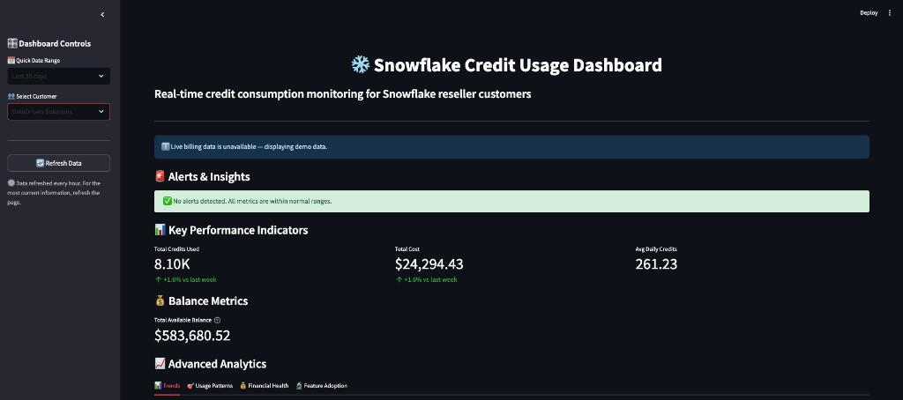

# ❄️ Snowflake Reseller Billing Dashboard

A **Streamlit in Snowflake** app for monitoring customer credit consumption, contract health, and feature adoption — powered by the `SNOWFLAKE.BILLING` schema.

[](https://streamlit.io/)
[](https://www.snowflake.com/)



---

## Deploy in 2 Steps

### Prerequisites
- Snowflake account with Streamlit in Snowflake enabled
- Access to `SNOWFLAKE.BILLING` schema (request via Snowflake Support if needed)
- `ACCOUNTADMIN` role

### Step 1 — Run `deploy.sql` in a Snowflake Worksheet

Opens a worksheet, pastes the file, and runs it. This creates the warehouse, role, and Streamlit app automatically.

### Step 2 — Grant access to your users
```sql
GRANT ROLE BILLING_DASHBOARD_USER TO USER <username>;
```

That's it. The app is now available under **Projects → Streamlit → `billing_dashboard`**.

> **No BILLING schema yet?** The app runs in demo mode automatically — no setup needed to explore the interface.

---

## What's Inside

| Tab | Description |
|-----|-------------|
| 📊 **Trends** | Daily credit and cost trends per customer |
| 🎯 **Usage Patterns** | Customer usage breakdown and growth comparisons |
| 💰 **Financial Health** | Balance projections, run rate, and contract capacity |
| 🔬 **Feature Adoption** | Feature usage per customer and upsell opportunities |

---

## Data Sources

| View | Purpose |
|------|---------|
| `PARTNER_USAGE_IN_CURRENCY_DAILY` | Daily credit usage by customer account |
| `PARTNER_REMAINING_BALANCE_DAILY` | Daily balance snapshots |
| `PARTNER_CONTRACT_ITEMS` | Contract terms and capacity |

---

## Troubleshooting

| Issue | Fix |
|-------|-----|
| `Object does not exist or not authorized` | Request `SNOWFLAKE.BILLING` access from Snowflake Support |
| No data showing | Check the date range filter in the sidebar |
| Stale data | Click **Refresh Data** in the sidebar |

```sql
-- Verify BILLING access
SELECT COUNT(*) FROM SNOWFLAKE.BILLING.PARTNER_USAGE_IN_CURRENCY_DAILY;
```

---

*Built for Snowflake reseller and distributor partners.*
